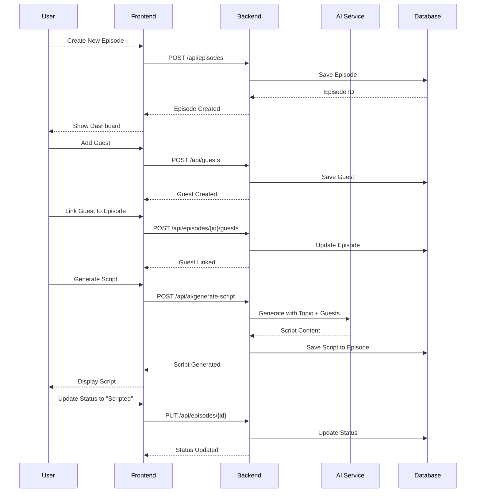

# Multi-Agent Architecture: Podcast Episode Planner & Script Assistant

## Overview

A linear multi-agent system where each agent completes its task and creates a context MD file for the next agent. Each agent reads the previous agent's output before starting.

```
Agent 1 → agent-1/README.md → Agent 2 → agent-2/README.md → Agent 3 → ... → Agent 6
```

---

## Agent Pipeline

### Agent 1: Product Manager (Requirements & Data Models)
**Status**: ✅ COMPLETED  
**Input**: User requirements / PRD  
**Output**: `agents/agent-1/README.md`

**Responsibilities**:
- Extract functional requirements
- Define data models (Episode, Guest)
- Create file structure
- Define acceptance criteria

**Deliverables**:
- Episode model with fields: id, title, topic, episode_number, planned_date, status, guests
- Guest model with fields: id, name, bio, area_of_expertise
- Status enum: Draft → Scripted → Published

---

### Agent 2: Backend Architect (API Design & Implementation)
**Status**: ✅ COMPLETED  
**Input**: `agents/agent-1/README.md`  
**Output**: `agents/agent-2/README.md`

**Responsibilities**:
- Design RESTful API endpoints
- Implement FastAPI backend
- Create Pydantic schemas
- Set up CORS and middleware

**Deliverables**:
- Episodes CRUD API (`/api/episodes`)
- Guests CRUD API (`/api/guests`)
- Guest-Episode linking endpoints
- API documentation (Swagger/ReDoc)

---

### Agent 3: Frontend Developer (UI Components)
**Status**: 🔲 PENDING  
**Input**: `agents/agent-2/README.md`  
**Output**: `agents/agent-3/README.md`

**Responsibilities**:
- Implement React components
- Build Episode Dashboard
- Build Guest Management UI
- Create forms for CRUD operations
- Connect to backend API

**Deliverables**:
- `App.jsx` - Main app with routing
- `EpisodeDashboard.jsx` - Episode list with status
- `EpisodeForm.jsx` - Create/Edit episode
- `GuestList.jsx` - Guest management
- `GuestForm.jsx` - Create/Edit guest

---

### Agent 4: AI Script Writer (AI Integration)
**Status**: 🔲 PENDING  
**Input**: `agents/agent-3/README.md`  
**Output**: `agents/agent-4/README.md`

**Responsibilities**:
- Integrate AI for script generation
- Generate episode scripts based on topic & guests
- Generate interview questions
- Create episode outlines
- Implement prompt engineering

**Deliverables**:
- `backend/api/ai.py` - AI endpoints
- `backend/services/script_generator.py` - Script generation logic
- `frontend/components/ScriptGenerator.jsx` - UI for AI features
- Prompt templates for different content types

---

### Agent 5: Integration & Testing
**Status**: 🔲 PENDING  
**Input**: `agents/agent-4/README.md`  
**Output**: `agents/agent-5/README.md`

**Responsibilities**:
- Write unit tests for backend
- Write integration tests
- Test API endpoints
- Validate frontend-backend integration
- Error handling & edge cases

**Deliverables**:
- `backend/tests/test_episodes.py`
- `backend/tests/test_guests.py`
- `backend/tests/test_ai.py`
- Test coverage report

---

### Agent 6: Documentation & Diagrams
**Status**: 🔲 PENDING  
**Input**: `agents/agent-5/README.md`  
**Output**: `agents/agent-6/README.md`

**Responsibilities**:
- Create Mermaid sequence diagrams
- Write API documentation
- Create user guide
- Document deployment steps

**Deliverables**:
- Sequence diagrams for all flows
- Architecture diagram
- README with setup instructions
- API reference documentation

---

## Sequence Diagram (Mermaid)



---

## Agent Communication Protocol

Each agent follows this protocol:

1. **Read Context**: Load previous agent's README.md
2. **Execute Tasks**: Complete assigned responsibilities
3. **Write Output**: Create/update own README.md with:
   - Status: COMPLETED
   - Summary of work done
   - Files created/modified
   - Context for next agent
4. **Signal Completion**: Mark agent as complete

---

## File Structure (Final)

```
SDLC_Agentic/
├── agents/
│   ├── agent-1/README.md      # Product Manager output
│   ├── agent-2/README.md      # Backend Architect output
│   ├── agent-3/README.md      # Frontend Developer output
│   ├── agent-4/README.md      # AI Script Writer output
│   ├── agent-5/README.md      # Testing output
│   ├── agent-6/README.md      # Documentation output
│   └── ARCHITECTURE.md        # This file
│
├── backend/
│   ├── api/
│   │   ├── episodes.py
│   │   ├── guests.py
│   │   └── ai.py              # Agent 4
│   ├── models/
│   │   ├── episode.py
│   │   └── guest.py
│   ├── services/
│   │   └── script_generator.py # Agent 4
│   ├── tests/                  # Agent 5
│   └── main.py
│
├── frontend/
│   ├── components/
│   │   ├── EpisodeDashboard.jsx
│   │   ├── EpisodeForm.jsx
│   │   ├── GuestList.jsx
│   │   ├── GuestForm.jsx
│   │   └── ScriptGenerator.jsx # Agent 4
│   └── App.jsx
│
├── docs/                       # Agent 6
│   ├── api-reference.md
│   ├── user-guide.md
│   └── diagrams/
│
├── requirements.txt
└── README.md
```

---

## Next Steps

Execute agents in order:
1. ✅ Agent 1 - DONE
2. ✅ Agent 2 - DONE
3. 🔲 Agent 3 - Frontend Developer - **START HERE**
4. 🔲 Agent 4 - AI Script Writer
5. 🔲 Agent 5 - Integration & Testing
6. 🔲 Agent 6 - Documentation

---

// Architecture defined. Ready to execute Agent 3.
