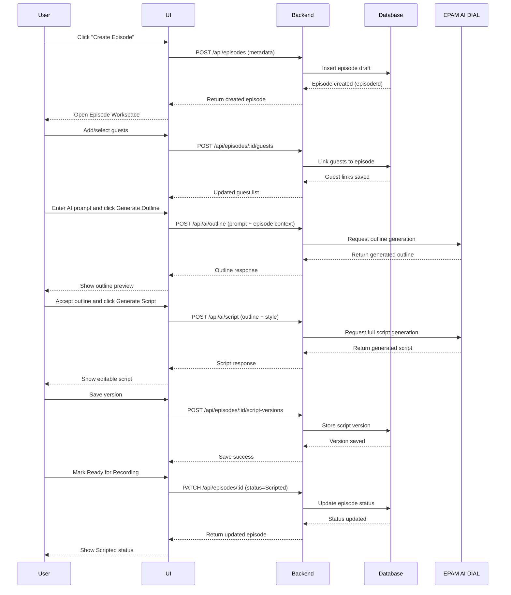

# Podcast Episode Planner + Script Assistant Workflow

```mermaid
sequenceDiagram
    participant User
    participant UI
    participant Backend
    participant Database
    participant EPAM AI DIAL

    User->>UI: Click "Create Episode"
    UI->>Backend: POST /api/episodes (metadata)
    Backend->>Database: Insert episode draft
    Database-->>Backend: Episode created (episodeId)
    Backend-->>UI: Return created episode
    UI-->>User: Open Episode Workspace

    User->>UI: Add/select guests
    UI->>Backend: POST /api/episodes/:id/guests
    Backend->>Database: Link guests to episode
    Database-->>Backend: Guest links saved
    Backend-->>UI: Updated guest list

    User->>UI: Enter AI prompt and click Generate Outline
    UI->>Backend: POST /api/ai/outline (prompt + episode context)
    Backend->>EPAM AI DIAL: Request outline generation
    EPAM AI DIAL-->>Backend: Return generated outline
    Backend-->>UI: Outline response
    UI-->>User: Show outline preview

    User->>UI: Accept outline and click Generate Script
    UI->>Backend: POST /api/ai/script (outline + style)
    Backend->>EPAM AI DIAL: Request full script generation
    EPAM AI DIAL-->>Backend: Return generated script
    Backend-->>UI: Script response
    UI-->>User: Show editable script

    User->>UI: Save version
    UI->>Backend: POST /api/episodes/:id/script-versions
    Backend->>Database: Store script version
    Database-->>Backend: Version saved
    Backend-->>UI: Save success

    User->>UI: Mark Ready for Recording
    UI->>Backend: PATCH /api/episodes/:id (status=Scripted)
    Backend->>Database: Update episode status
    Database-->>Backend: Status updated
    Backend-->>UI: Return updated episode
    UI-->>User: Show Scripted status
```
